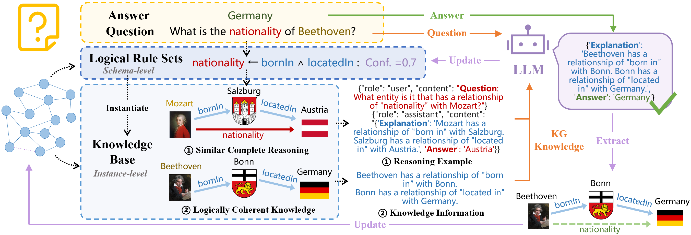

<div align="center">    
 
# SIR: Reasoning for LLMs through Self-Improving Rule-Guided Knowledge Graph Integration

</div>

- [Overview](#overview)
- [Requirements](#requirements)
- [Usage](#usage)

 
## Overview  



<br/>
Large language models (LLMs) often struggle with logical reasoning, frequently producing unfaithful answers. A significant bottleneck is the lack of large-scale, step-by-step reasoning traces data, which are costly to produce manually. While knowledge graphs (KGs) offer a promising source of structured knowledge to automate this process, directly extracting knowledge from KGs as context poses two challenges: (1) the extracted knowledge may be semantically related but logically incoherent, which can mislead the model, and (2) KGs are inherently incomplete, so the knowledge included in the context may be insufficient. To address these issues, we propose SIR, a self-improving rule-guided reasoning framework for LLMs. SIR leverages logical rules to extract coherent paths from KGs, generating faithful reasoning traces to guide the LLM. This rule-driven approach ensures the provided context is logically consistent. Furthermore, it incorporates a self-improving feedback loop that extracts new knowledge from the LLM's successful reasoning to dynamically enhancing the coverage of KG and rule sets for future queries. Experiments demonstrate that SIR can improve the reasoning performance of LLMs on multiple reasoning benchmarks.

## Requirements

1. Clone the repository:
 ```bash
 git clone https://github.com/PerseidsMeteorShower/SIR.git
 ```

2. Install the required libraries:
```bash
pip install -r requirements.txt
```

3. Install spaCy English model:
```bash
python -m spacy download en_core_web_sm
```

4. Replace the API key and endpoint with your own API configuration in the config.json
```bash
{
    "API_KEY": "your_api_key_here",
    "AZURE_ENDPOINT": "your_azure_endpoint_here"
}
```

## Usage

The following is an example based on the CSRL learning logical rules and verifies the reliability of the rules.

1. Firstly, calculate the embeddings of entities and embeddings in KG.
```
  python get_embeddings.py --dataset DBpedia --model_path sentence_transformer
```
Meanings of each parameter:

* --dataset: Knowledge graph name.
* --model_path: Path to the model for semantic embedding.

2. Apply SIR.
```
  python main.py --test_set_path BeerQA --dataset DBpedia --model_path sentence_transformer --batch_size 8 --limit 10000 --result_folder result > output.log
```
Meanings of each parameter:

* --test_set: test QA set name.
* --dataset: Knowledge graph name.
* --model_path: Path to the model for semantic embedding.
* --limit: Limit number of questions to test.
* --batch_size: Batch size for questions to be processed.
* --result_folder: output folder for results.

