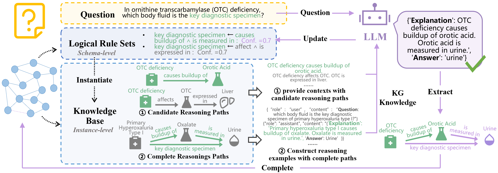

<div align="center">    
 
# SER: Reasoning for LLMs through Self-Evaluation Rule-Guided Knowledge Graph Integration

</div>

- [Overview](#overview)
- [Requirements](#requirements)
- [Usage](#usage)

 
## Overview  



<br/>
Despite advances in language understanding and generation, large language models (LLMs) still lack the specialized and verifiable knowledge required in medical settings. Knowledge graphs (KGs) can ground model outputs and support safe reasoning. However, medical reasoning is often implicit. The relations in reasoning path are usually not stated directly in the question. This forces LLMs to infer the path themselves, making errors more likely. At the same time, KGs are always incomplete and miss edges, which further blocks effective path finding. To address these challenges, we propose SER, a self-evolution rule-guided reasoning framework for LLM. SER uses logical rules to extract faithful reasoning paths from the KG, ensuring that the retrieved paths are both reliable and informative. Furthermore, it incorporates a self-evolution feedback loop that captures new knowledge from the LLM’s successful reasoning, gradually expanding the coverage of the KG and rule set for future queries. Experiments show that SER improves LLM reasoning performance across multiple medical benchmarks.

## Requirements

1. Clone the repository:
 ```bash
 git clone https://github.com/PerseidsMeteorShower/SER.git
 ```

2. Install the required libraries:
```bash
pip install -r requirements.txt
```

3. Install spaCy English model:
```bash
python -m spacy download en_core_web_sm
```

4. Replace the API key and endpoint with your own API configuration in the config.json
```bash
{
    "API_KEY": "your_api_key_here",
    "AZURE_ENDPOINT": "your_azure_endpoint_here"
}
```

## Usage

The following is an example based on the CSRL learning logical rules and verifies the reliability of the rules.

1. Firstly, calculate the embeddings of entities and embeddings in KG.
```
  python get_embeddings.py --dataset DBpedia --model_path sentence_transformer
```
Meanings of each parameter:

* --dataset: Knowledge graph name.
* --model_path: Path to the model for semantic embedding.

2. Apply SIR.
```
  python main.py --test_set_path BeerQA --dataset DBpedia --model_path sentence_transformer --batch_size 8 --limit 10000 --result_folder result > output.log
```
Meanings of each parameter:

* --test_set: test QA set name.
* --dataset: Knowledge graph name.
* --model_path: Path to the model for semantic embedding.
* --limit: Limit number of questions to test.
* --batch_size: Batch size for questions to be processed.
* --result_folder: output folder for results.

